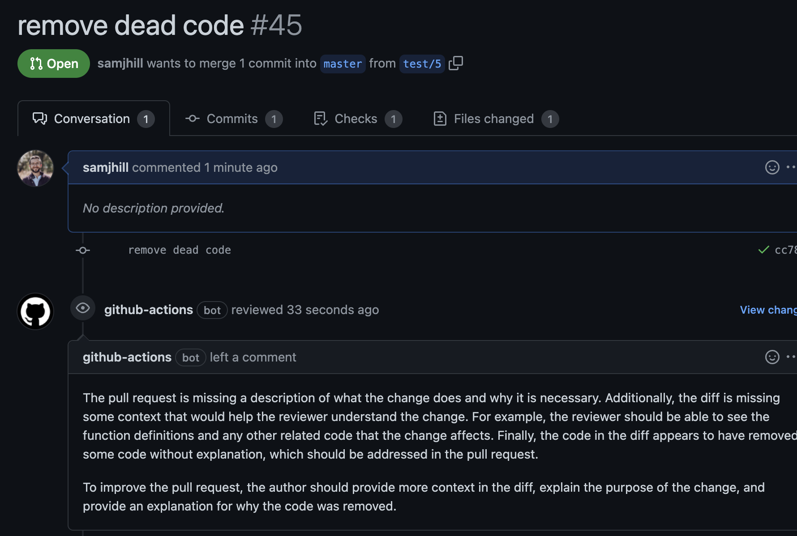

# GPTReview 🤖🔍

Get OpenAI GPT models to suggest changes on your pull request in the comments!

## How to integrate into your repo:

1. Copy the workflow from this repo's .github/workflows/review.yml into your project in the same location.

2. Add the review.py script to the root of your repository.

3. Get an [OpenAI key here](https://openai.com/api/)

4. Create a secret in your project's settings called OPENAI_API_KEY for your OpenAI API Key
